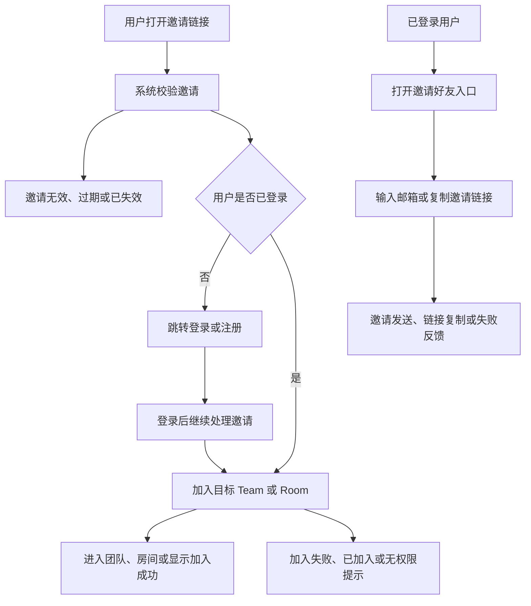

# Invite 交互图

```mermaid
flowchart TD
  Link["用户打开邀请链接"] --> Validate["系统校验邀请"]
  Validate --> Invalid["邀请无效、过期或已失效"]
  Validate --> NeedAuth{"用户是否已登录"}
  NeedAuth -->|否| Auth["跳转登录或注册"]
  Auth --> Back["登录后继续处理邀请"]
  NeedAuth -->|是| Join["加入目标 Team 或 Room"]
  Back --> Join
  Join --> Success["进入团队、房间或显示加入成功"]
  Join --> Failed["加入失败、已加入或无权限提示"]
  Inviter["已登录用户"] --> InviteFriend["打开邀请好友入口"]
  InviteFriend --> Send["输入邮箱或复制邀请链接"]
  Send --> Sent["邀请发送、链接复制或失败反馈"]
```

