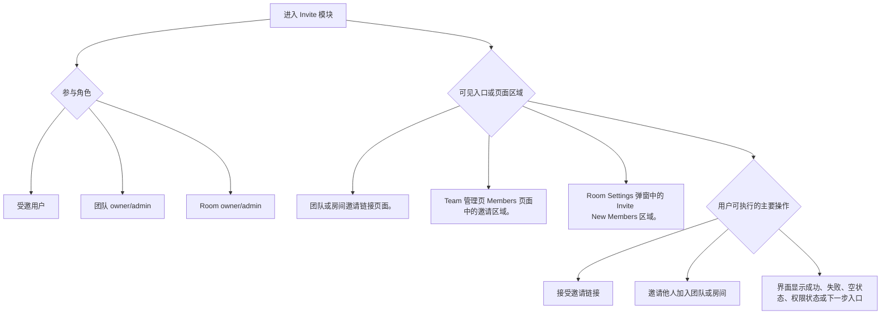

# Invite 粗粒度交互图

本图用于快速说明 Invite 模块有哪些参与角色、入口、主要能力和结果状态。它不展开每个控件的全部状态，详细交互见 [invite-detailed-interaction-diagram.md](./invite-detailed-interaction-diagram.md)。

```mermaid
flowchart TD
  Start["进入 Invite 模块"]
  Start --> Actors{"参与角色"}
  Actors --> A1["受邀用户"]
  Actors --> A2["团队 owner/admin"]
  Actors --> A3["Room owner/admin"]
  Start --> Entry{"可见入口或页面区域"}
  Entry --> E1["团队或房间邀请链接页面。"]
  Entry --> E2["Team 管理页 Members 页面中的邀请区域。"]
  Entry --> E3["Room Settings 弹窗中的 Invite <br/>New Members 区域。"]
  Entry --> Capabilities{"用户可执行的主要操作"}
  Capabilities --> UC1["接受邀请链接"]
  Capabilities --> UC2["邀请他人加入团队或房间"]
  Capabilities --> Result["界面显示成功、失败、空状态、权限状态或下一步入口"]
```
