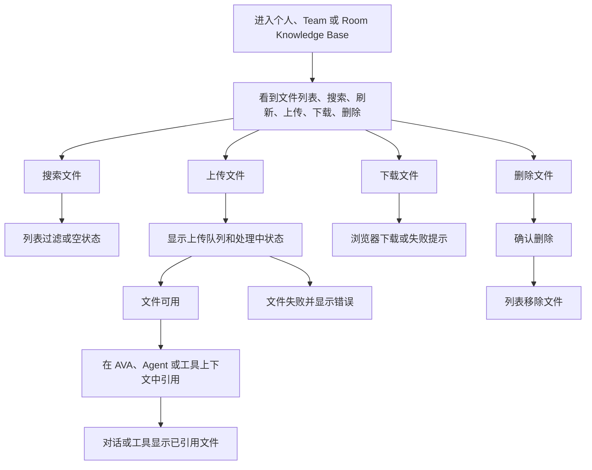

# Knowledge Base 交互图

```mermaid
flowchart TD
  KB["进入个人、Team 或 Room Knowledge Base"] --> List["看到文件列表、搜索、刷新、上传、下载、删除"]
  List --> Search["搜索文件"]
  Search --> Filtered["列表过滤或空状态"]
  List --> Upload["上传文件"]
  Upload --> Queue["显示上传队列和处理中状态"]
  Queue --> Ready["文件可用"]
  Queue --> Failed["文件失败并显示错误"]
  List --> Download["下载文件"]
  Download --> DownloadResult["浏览器下载或失败提示"]
  List --> Delete["删除文件"]
  Delete --> Confirm["确认删除"]
  Confirm --> Removed["列表移除文件"]
  Ready --> UseInAI["在 AVA、Agent 或工具上下文中引用"]
  UseInAI --> AIContext["对话或工具显示已引用文件"]
```

