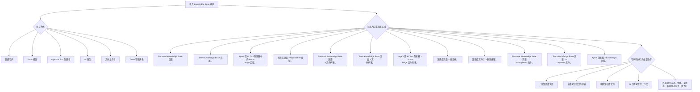

# Knowledge Base 粗粒度交互图

本图用于快速说明 Knowledge Base 模块有哪些参与角色、入口、主要能力和结果状态。它不展开每个控件的全部状态，详细交互见 [knowledge-base-detailed-interaction-diagram.md](./knowledge-base-detailed-interaction-diagram.md)。

```mermaid
flowchart TD
  Start["进入 Knowledge Base 模块"]
  Start --> Actors{"参与角色"}
  Actors --> A1["普通用户"]
  Actors --> A2["Team 成员"]
  Actors --> A3["Agent/AI Tool 创建者"]
  Actors --> A4["AI 服务"]
  Actors --> A5["文件上传者"]
  Actors --> A6["Team 管理角色"]
  Start --> Entry{"可见入口或页面区域"}
  Entry --> E1["Personal Knowledge Base 页面<br/>。"]
  Entry --> E2["Team Knowledge Base 页面。"]
  Entry --> E3["Agent 或 AI Tool 创建器中的 Know<br/>ledge 区域。"]
  Entry --> E4["知识库页面 > Upload File 按钮。"]
  Entry --> E5["Personal Knowledge Base 页面<br/> > 文件列表。"]
  Entry --> E6["Team Knowledge Base 页面 > 文<br/>件列表。"]
  Entry --> E7["Agent 或 AI Tool 创建器 > Know<br/>ledge 文件列表。"]
  Entry --> E8["知识库页面 > 搜索框。"]
  Entry --> E9["知识库文件行 > 删除按钮。"]
  Entry --> E10["Personal Knowledge Base 页面<br/> > completed 文件。"]
  Entry --> E11["Team Knowledge Base 页面 > c<br/>ompleted 文件。"]
  Entry --> E12["Agent 创建器 > Knowledge 区域。"]
  Entry --> Capabilities{"用户可执行的主要操作"}
  Capabilities --> UC1["上传知识库文件"]
  Capabilities --> UC2["查看知识库文件列表"]
  Capabilities --> UC3["删除知识库文件"]
  Capabilities --> UC4["AI 引用知识库上下文"]
  Capabilities --> Result["界面显示成功、失败、空状态、权限状态或下一步入口"]
```
