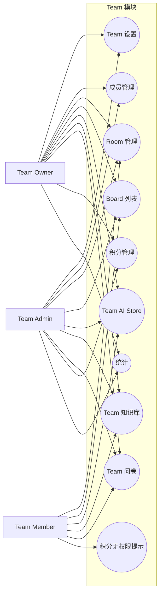
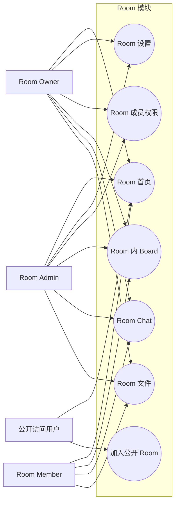
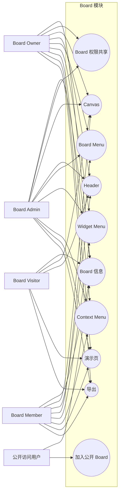
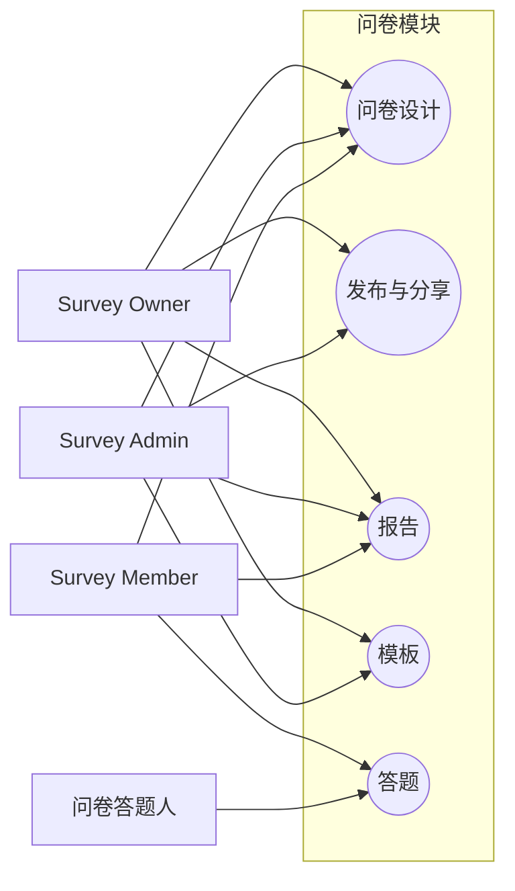

# BoardX 模块访问权限 Use Case Diagram

本文档按模块描述“哪些角色可以访问哪些一级功能”。当某个模块存在 owner/admin/member/visitor 等权限差异时，本文件只画模块级边界，具体操作下钻到模块目录中的 Use Case。

## Team 模块访问

## Room 模块访问

## Board 模块访问

## Survey 模块访问

