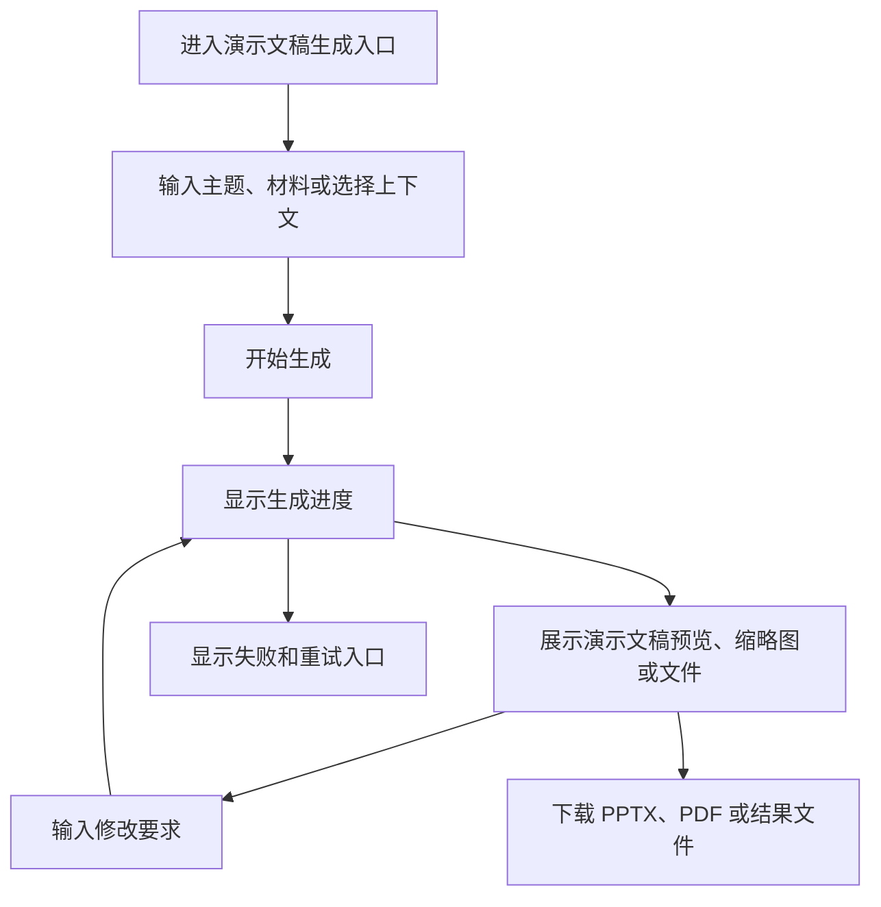

# Presentations 交互图

```mermaid
flowchart TD
  Entry["进入演示文稿生成入口"] --> Input["输入主题、材料或选择上下文"]
  Input --> Generate["开始生成"]
  Generate --> Progress["显示生成进度"]
  Progress --> Preview["展示演示文稿预览、缩略图或文件"]
  Progress --> Failed["显示失败和重试入口"]
  Preview --> Revise["输入修改要求"]
  Revise --> Progress
  Preview --> Download["下载 PPTX、PDF 或结果文件"]
```

