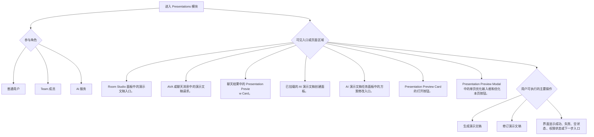

# Presentations 粗粒度交互图

本图用于快速说明 Presentations 模块有哪些参与角色、入口、主要能力和结果状态。它不展开每个控件的全部状态，详细交互见 [presentations-detailed-interaction-diagram.md](./presentations-detailed-interaction-diagram.md)。

```mermaid
flowchart TD
  Start["进入 Presentations 模块"]
  Start --> Actors{"参与角色"}
  Actors --> A1["普通用户"]
  Actors --> A2["Team 成员"]
  Actors --> A3["AI 服务"]
  Start --> Entry{"可见入口或页面区域"}
  Entry --> E1["Room Studio 面板中的演示文稿入口。"]
  Entry --> E2["AVA 或聊天消息中的演示文稿请求。"]
  Entry --> E3["聊天结果中的 Presentation Previe<br/>w Card。"]
  Entry --> E4["已挂载的 AI 演示文稿创建面板。"]
  Entry --> E5["AI 演示文稿任务面板中的方案修改入口。"]
  Entry --> E6["Presentation Preview Card <br/>的打开按钮。"]
  Entry --> E7["Presentation Preview Modal<br/> 中的单页优化输入框和优化本页按钮。"]
  Entry --> Capabilities{"用户可执行的主要操作"}
  Capabilities --> UC1["生成演示文稿"]
  Capabilities --> UC2["修订演示文稿"]
  Capabilities --> Result["界面显示成功、失败、空状态、权限状态或下一步入口"]
```
