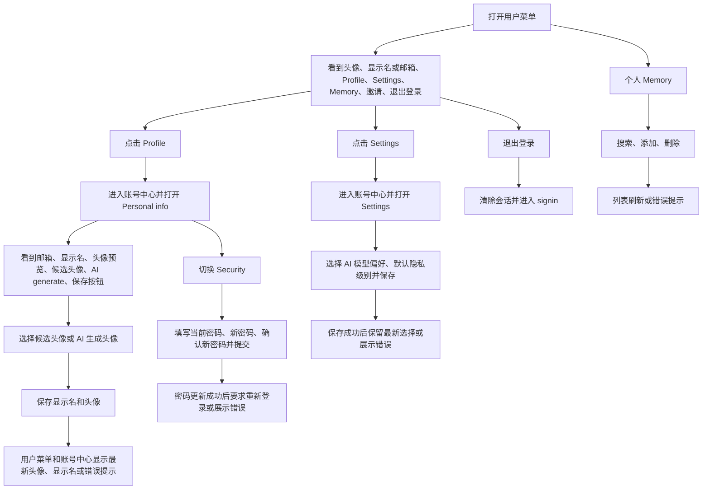

# Profile / Account Center 交互图

```mermaid
flowchart TD
  Menu["打开用户菜单"] --> MenuItems["看到头像、显示名或邮箱、Profile、Settings、Memory、邀请、退出登录"]
  MenuItems --> Profile["点击 Profile"]
  MenuItems --> SettingsEntry["点击 Settings"]
  Profile --> AccountProfile["进入账号中心并打开 Personal info"]
  SettingsEntry --> AccountSettings["进入账号中心并打开 Settings"]
  AccountProfile --> ProfileOps["看到邮箱、显示名、头像预览、候选头像、AI generate、保存按钮"]
  ProfileOps --> PickAvatar["选择候选头像或 AI 生成头像"]
  PickAvatar --> SaveProfile["保存显示名和头像"]
  SaveProfile --> ProfileResult["用户菜单和账号中心显示最新头像、显示名或错误提示"]
  AccountProfile --> Security["切换 Security"]
  Security --> PasswordOps["填写当前密码、新密码、确认新密码并提交"]
  PasswordOps --> PasswordResult["密码更新成功后要求重新登录或展示错误"]
  AccountSettings --> SettingsOps["选择 AI 模型偏好、默认隐私级别并保存"]
  SettingsOps --> SettingsResult["保存成功后保留最新选择或展示错误"]
  Menu --> Memory["个人 Memory"]
  Memory --> MemoryOps["搜索、添加、删除"]
  MemoryOps --> MemoryResult["列表刷新或错误提示"]
  MenuItems --> Logout["退出登录"]
  Logout --> Signin["清除会话并进入 signin"]
```
