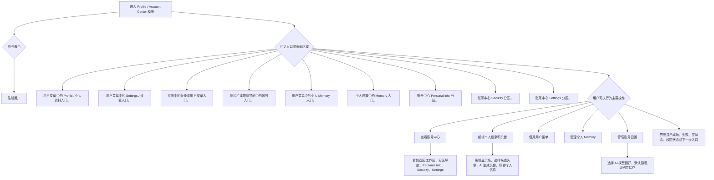

# Profile 粗粒度交互图

本图用于快速说明 Profile 模块有哪些参与角色、入口、主要能力和结果状态。它不展开每个控件的全部状态，详细交互见 [profile-detailed-interaction-diagram.md](./profile-detailed-interaction-diagram.md)。

```mermaid
flowchart TD
  Start["进入 Profile / Account Center 模块"]
  Start --> Actors{"参与角色"}
  Actors --> A1["注册用户"]
  Start --> Entry{"可见入口或页面区域"}
  Entry --> E1["用户菜单中的 Profile / 个人资料入口。"]
  Entry --> E2["用户菜单中的 Settings / 设置入口。"]
  Entry --> E3["页面中的头像或用户菜单入口。"]
  Entry --> E4["侧边栏或顶部导航中的账号入口。"]
  Entry --> E5["用户菜单中的个人 Memory 入口。"]
  Entry --> E6["个人设置中的 Memory 入口。"]
  Entry --> E7["账号中心 Personal info 分区。"]
  Entry --> E8["账号中心 Security 分区。"]
  Entry --> E9["账号中心 Settings 分区。"]
  Entry --> Capabilities{"用户可执行的主要操作"}
  Capabilities --> UC1["查看账号中心"]
  Capabilities --> UC2["编辑个人信息和头像"]
  Capabilities --> UC3["使用用户菜单"]
  Capabilities --> UC4["管理个人 Memory"]
  Capabilities --> UC5["管理账号设置"]
  UC1 --> S1["看到返回工作区、分区导航、Personal info、Security、Settings"]
  UC2 --> S2["编辑显示名、选择候选头像、AI 生成头像、保存个人信息"]
  UC5 --> S3["选择 AI 模型偏好、默认隐私级别并保存"]
  Capabilities --> Result["界面显示成功、失败、空状态、权限状态或下一步入口"]
```
