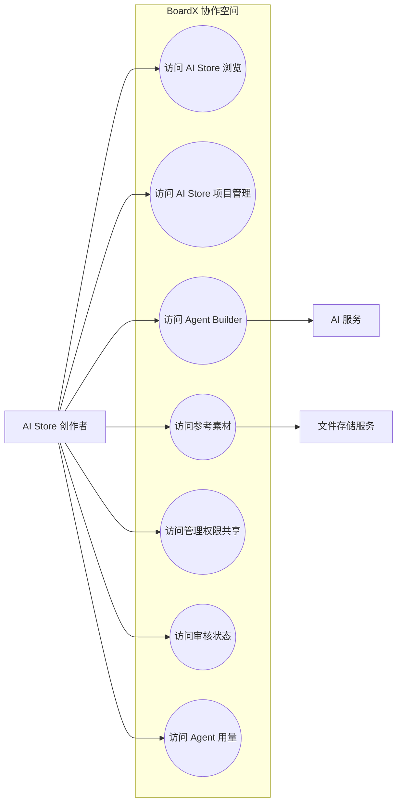

# AI Store 创作者 Use Case Diagram

AI Store 创作者的最外层可操作模块包括 AI Store 项目管理、Agent Builder、素材、共享、审核状态和用量。

```mermaid
flowchart LR
  StoreCreator["AI Store 创作者"]
  AI["AI 服务"]
  Storage["文件存储服务"]

  subgraph BoardX["BoardX 协作空间"]
    StoreExplore(("访问 AI Store 浏览"))
    StoreItemAdmin(("访问 AI Store 项目管理"))
    AgentBuilder(("访问 Agent Builder"))
    ReferenceAssets(("访问参考素材"))
    ManagementShare(("访问管理权限共享"))
    Approval(("访问审核状态"))
    Usage(("访问 Agent 用量"))
  end

  StoreCreator --> StoreExplore
  StoreCreator --> StoreItemAdmin
  StoreCreator --> AgentBuilder
  StoreCreator --> ReferenceAssets
  StoreCreator --> ManagementShare
  StoreCreator --> Approval
  StoreCreator --> Usage

  AgentBuilder --> AI
  ReferenceAssets --> Storage
```
