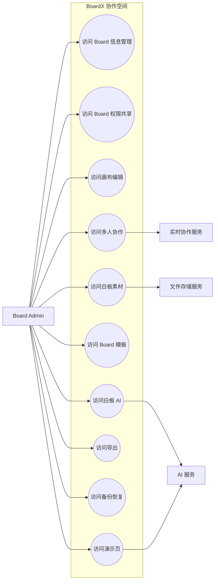

# Board Admin Use Case Diagram

Board Admin 拥有 Board 管理权限，可访问权限共享、Board 信息、画布协作、素材、模板、演示、导出、备份和白板 AI 等一级模块。

```mermaid
flowchart LR
  BoardAdmin["Board Admin"]
  AI["AI 服务"]
  Storage["文件存储服务"]
  Realtime["实时协作服务"]

  subgraph BoardX["BoardX 协作空间"]
    BoardInfo(("访问 Board 信息管理"))
    BoardAccess(("访问 Board 权限共享"))
    Canvas(("访问画布编辑"))
    Collaboration(("访问多人协作"))
    BoardMedia(("访问白板素材"))
    BoardTemplate(("访问 Board 模板"))
    Slides(("访问演示页"))
    Export(("访问导出"))
    Backup(("访问备份恢复"))
    BoardAI(("访问白板 AI"))
  end

  BoardAdmin --> BoardInfo
  BoardAdmin --> BoardAccess
  BoardAdmin --> Canvas
  BoardAdmin --> Collaboration
  BoardAdmin --> BoardMedia
  BoardAdmin --> BoardTemplate
  BoardAdmin --> Slides
  BoardAdmin --> Export
  BoardAdmin --> Backup
  BoardAdmin --> BoardAI

  Collaboration --> Realtime
  BoardMedia --> Storage
  BoardAI --> AI
  Slides --> AI
```

