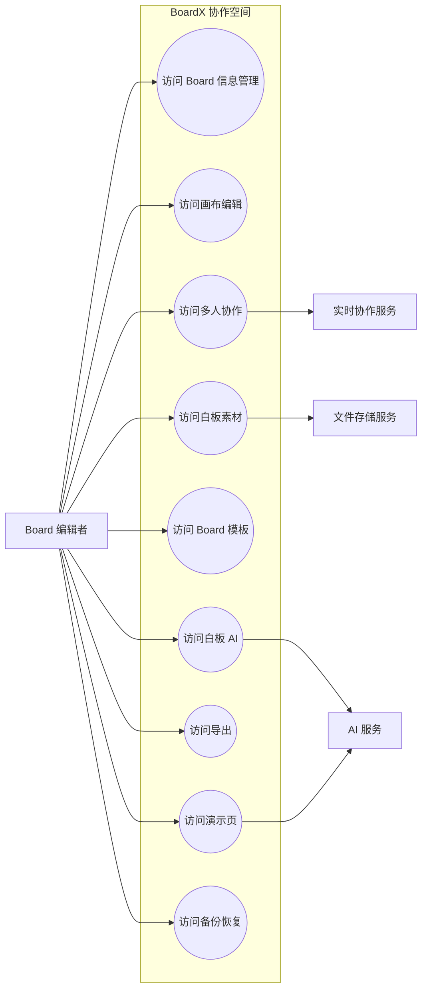

# Board 编辑者 Use Case Diagram

Board 编辑者在白板中的最外层可操作模块包括 Board 信息、画布、协作、素材、模板、演示、导出和白板 AI。

```mermaid
flowchart LR
  BoardEditor["Board 编辑者"]
  AI["AI 服务"]
  Storage["文件存储服务"]
  Realtime["实时协作服务"]

  subgraph BoardX["BoardX 协作空间"]
    BoardInfo(("访问 Board 信息管理"))
    Canvas(("访问画布编辑"))
    Collaboration(("访问多人协作"))
    BoardMedia(("访问白板素材"))
    BoardTemplate(("访问 Board 模板"))
    Slides(("访问演示页"))
    Export(("访问导出"))
    BoardAI(("访问白板 AI"))
    Backup(("访问备份恢复"))
  end

  BoardEditor --> BoardInfo
  BoardEditor --> Canvas
  BoardEditor --> Collaboration
  BoardEditor --> BoardMedia
  BoardEditor --> BoardTemplate
  BoardEditor --> Slides
  BoardEditor --> Export
  BoardEditor --> BoardAI
  BoardEditor --> Backup

  Collaboration --> Realtime
  BoardMedia --> Storage
  BoardAI --> AI
  Slides --> AI
```
