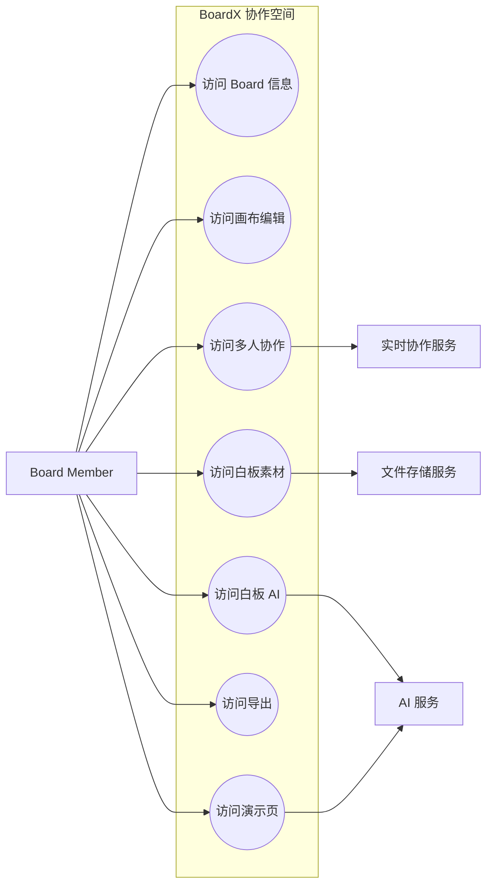

# Board Member Use Case Diagram

Board Member 对应 Board subscription 中的 `user` 角色，主要拥有 Board 访问、画布编辑、协作、素材、演示、导出和白板 AI 的一级模块入口。

```mermaid
flowchart LR
  BoardMember["Board Member"]
  AI["AI 服务"]
  Storage["文件存储服务"]
  Realtime["实时协作服务"]

  subgraph BoardX["BoardX 协作空间"]
    BoardInfo(("访问 Board 信息"))
    Canvas(("访问画布编辑"))
    Collaboration(("访问多人协作"))
    BoardMedia(("访问白板素材"))
    Slides(("访问演示页"))
    Export(("访问导出"))
    BoardAI(("访问白板 AI"))
  end

  BoardMember --> BoardInfo
  BoardMember --> Canvas
  BoardMember --> Collaboration
  BoardMember --> BoardMedia
  BoardMember --> Slides
  BoardMember --> Export
  BoardMember --> BoardAI

  Collaboration --> Realtime
  BoardMedia --> Storage
  BoardAI --> AI
  Slides --> AI
```

