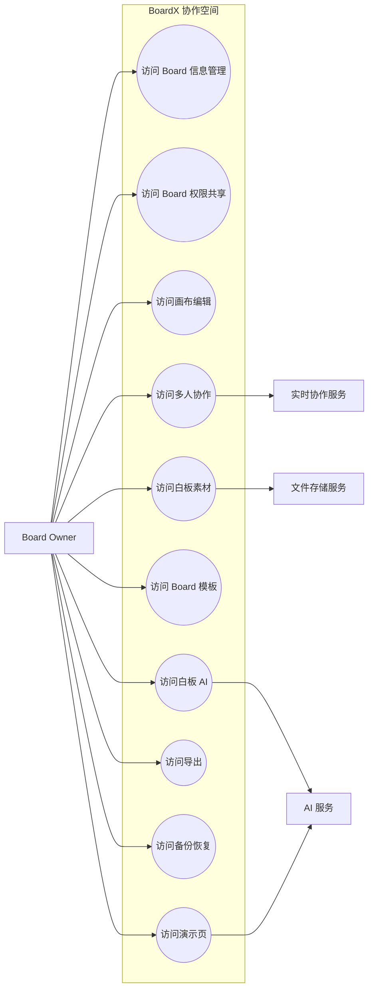

# Board Owner Use Case Diagram

Board Owner 是 Board 的最高权限角色，拥有 Board 信息、权限共享、画布、协作、素材、模板、演示、导出、备份和白板 AI 等一级模块入口。

```mermaid
flowchart LR
  BoardOwner["Board Owner"]
  AI["AI 服务"]
  Storage["文件存储服务"]
  Realtime["实时协作服务"]

  subgraph BoardX["BoardX 协作空间"]
    BoardInfo(("访问 Board 信息管理"))
    BoardAccess(("访问 Board 权限共享"))
    Canvas(("访问画布编辑"))
    Collaboration(("访问多人协作"))
    BoardMedia(("访问白板素材"))
    BoardTemplate(("访问 Board 模板"))
    Slides(("访问演示页"))
    Export(("访问导出"))
    Backup(("访问备份恢复"))
    BoardAI(("访问白板 AI"))
  end

  BoardOwner --> BoardInfo
  BoardOwner --> BoardAccess
  BoardOwner --> Canvas
  BoardOwner --> Collaboration
  BoardOwner --> BoardMedia
  BoardOwner --> BoardTemplate
  BoardOwner --> Slides
  BoardOwner --> Export
  BoardOwner --> Backup
  BoardOwner --> BoardAI

  Collaboration --> Realtime
  BoardMedia --> Storage
  BoardAI --> AI
  Slides --> AI
```

