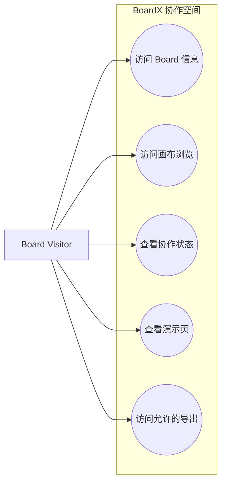

# Board Visitor Use Case Diagram

Board Visitor 是 Board 的只读访问角色，主要拥有查看 Board、浏览画布、查看演示和导出受限内容的一级模块入口。

```mermaid
flowchart LR
  BoardVisitor["Board Visitor"]

  subgraph BoardX["BoardX 协作空间"]
    BoardInfo(("访问 Board 信息"))
    CanvasView(("访问画布浏览"))
    CollaborationView(("查看协作状态"))
    SlidesView(("查看演示页"))
    ExportView(("访问允许的导出"))
  end

  BoardVisitor --> BoardInfo
  BoardVisitor --> CanvasView
  BoardVisitor --> CollaborationView
  BoardVisitor --> SlidesView
  BoardVisitor --> ExportView
```

