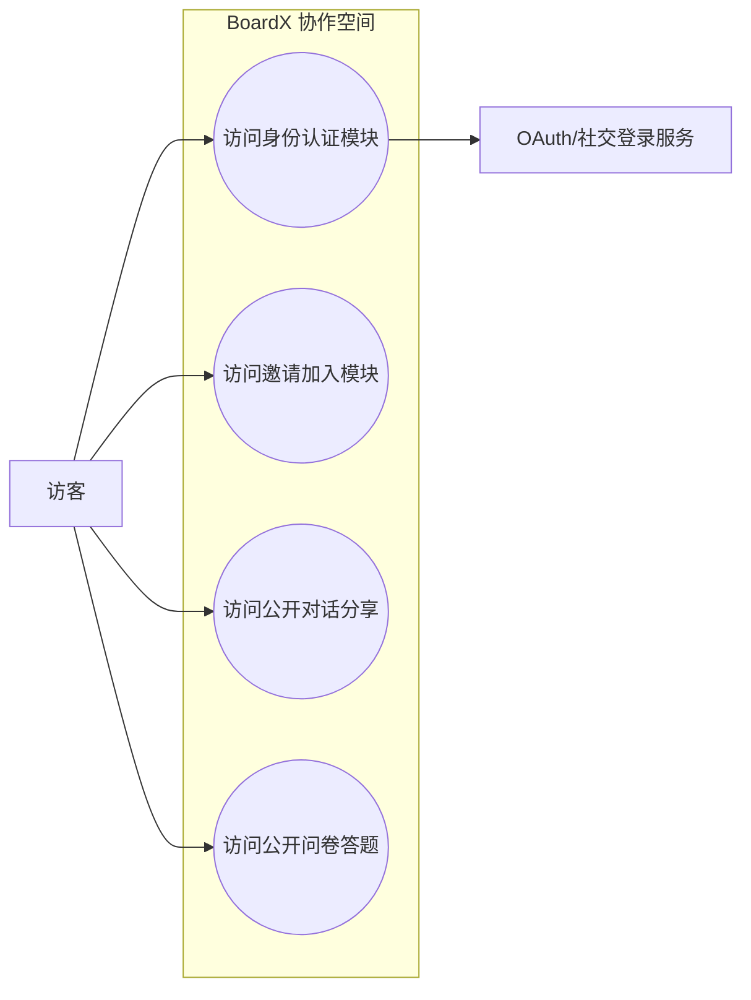

# 访客 Use Case Diagram

访客是尚未登录 BoardX 的用户，最外层可操作模块主要是身份入口、邀请入口、公开分享和公开问卷。

```mermaid
flowchart LR
  Guest["访客"]
  OAuth["OAuth/社交登录服务"]

  subgraph BoardX["BoardX 协作空间"]
    Auth(("访问身份认证模块"))
    Invite(("访问邀请加入模块"))
    SharedChat(("访问公开对话分享"))
    PublicSurvey(("访问公开问卷答题"))
  end

  Guest --> Auth
  Guest --> Invite
  Guest --> SharedChat
  Guest --> PublicSurvey

  Auth --> OAuth
```
