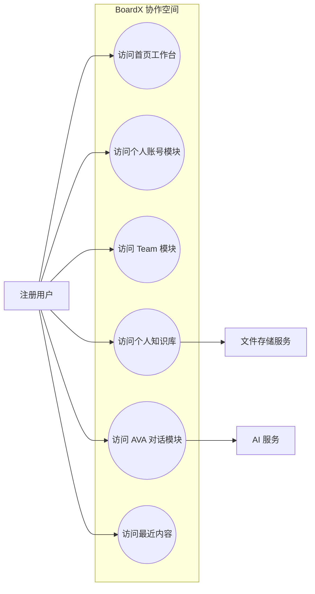

# 注册用户 Use Case Diagram

注册用户是已经登录 BoardX 的基础角色，最外层可操作模块包括首页、个人账号、Team 入口、个人知识库和 AVA。

```mermaid
flowchart LR
  User["注册用户"]
  AI["AI 服务"]
  Storage["文件存储服务"]

  subgraph BoardX["BoardX 协作空间"]
    Home(("访问首页工作台"))
    Account(("访问个人账号模块"))
    TeamEntry(("访问 Team 模块"))
    PersonalKnowledge(("访问个人知识库"))
    Ava(("访问 AVA 对话模块"))
    Recent(("访问最近内容"))
  end

  User --> Home
  User --> Account
  User --> TeamEntry
  User --> PersonalKnowledge
  User --> Ava
  User --> Recent

  PersonalKnowledge --> Storage
  Ava --> AI
```
