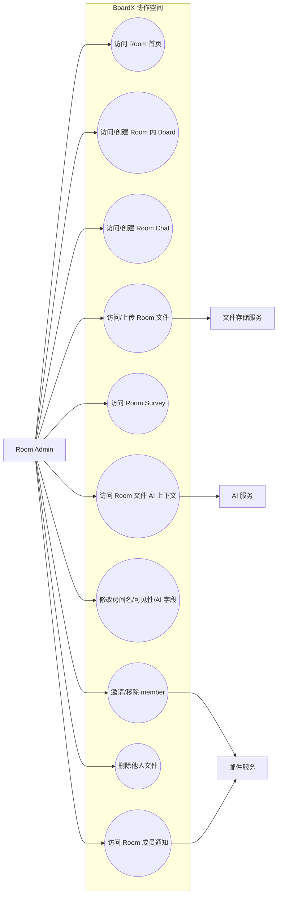

# Room Admin Use Case Diagram

Room Admin 拥有 Room 内日常管理权限（权威矩阵见 uc-rr-006）：可邀请/移除 member、
修改房间名/可见性/AI 上下文字段、删除他人文件。与 owner 的差异——admin **不能**：
提升/降级 admin、移除 admin、删除房间、移除/变更 owner（这些操作 API 一律返回 403）。

> 不含节点（owner 专属，admin 调用返回 403）：提升/降级/移除 admin、删除房间、移除/变更 owner。
