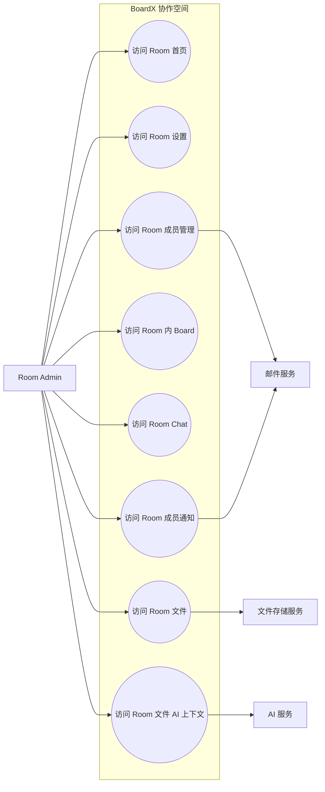

# Room Admin Use Case Diagram

Room Admin 拥有 Room 内管理权限，可访问 Room 设置、成员管理、文件、对话和 Board 相关一级模块。

```mermaid
flowchart LR
  RoomAdmin["Room Admin"]
  Mail["邮件服务"]
  Storage["文件存储服务"]
  AI["AI 服务"]

  subgraph BoardX["BoardX 协作空间"]
    RoomHome(("访问 Room 首页"))
    RoomSettings(("访问 Room 设置"))
    RoomMemberAdmin(("访问 Room 成员管理"))
    RoomBoard(("访问 Room 内 Board"))
    RoomChat(("访问 Room Chat"))
    RoomFiles(("访问 Room 文件"))
    RoomAIContext(("访问 Room 文件 AI 上下文"))
    Notification(("访问 Room 成员通知"))
  end

  RoomAdmin --> RoomHome
  RoomAdmin --> RoomSettings
  RoomAdmin --> RoomMemberAdmin
  RoomAdmin --> RoomBoard
  RoomAdmin --> RoomChat
  RoomAdmin --> RoomFiles
  RoomAdmin --> RoomAIContext
  RoomAdmin --> Notification

  RoomMemberAdmin --> Mail
  Notification --> Mail
  RoomFiles --> Storage
  RoomAIContext --> AI
```

