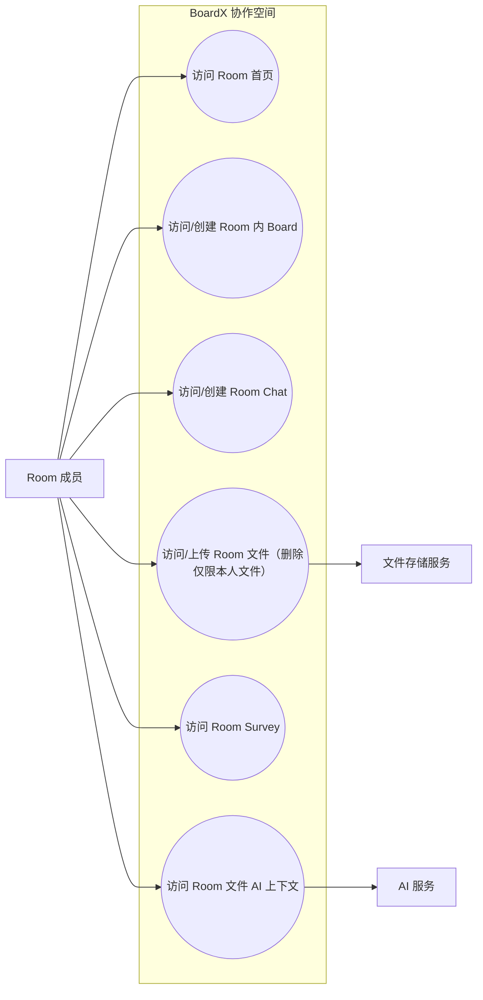

# Room 成员 Use Case Diagram

Room 成员（member）没有任何房间管理权（权威矩阵见 uc-rr-006）：可查看房间/Boards/Files/Chat/Survey，
可上传文件、创建聊天、创建 board；只能删除本人文件；不能邀请/移除成员、不能改角色、
不能修改房间设置、不能删除房间（这些操作 API 一律返回 403，UI 不展示对应入口）。

> 不含节点（owner/admin 专属）：邀请/移除 member、修改房间名/可见性/AI 字段、删除他人文件；
> owner 专属：提升/降级/移除 admin、删除房间。
