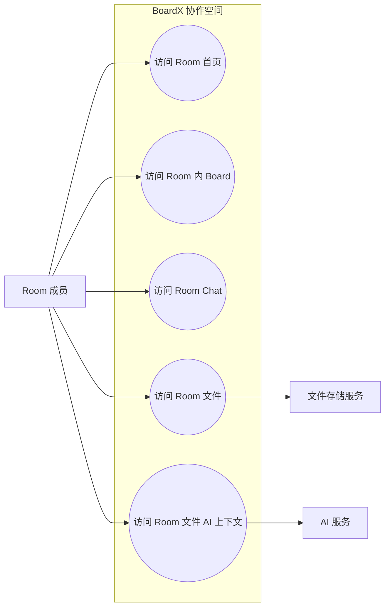

# Room 成员 Use Case Diagram

Room 成员在 Room 中的最外层可操作模块包括 Room 首页、Board、Room Chat 和 Room 文件。

```mermaid
flowchart LR
  RoomMember["Room 成员"]
  Storage["文件存储服务"]
  AI["AI 服务"]

  subgraph BoardX["BoardX 协作空间"]
    RoomHome(("访问 Room 首页"))
    RoomBoard(("访问 Room 内 Board"))
    RoomChat(("访问 Room Chat"))
    RoomFiles(("访问 Room 文件"))
    RoomAIContext(("访问 Room 文件 AI 上下文"))
  end

  RoomMember --> RoomHome
  RoomMember --> RoomBoard
  RoomMember --> RoomChat
  RoomMember --> RoomFiles
  RoomMember --> RoomAIContext

  RoomFiles --> Storage
  RoomAIContext --> AI
```
