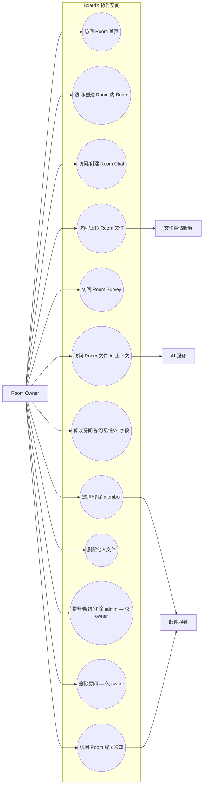

# Room Owner Use Case Diagram

Room Owner 是 Room 的最高权限角色（权威矩阵见 uc-rr-006）。除 owner/admin 共有的房间管理能力
（邀请/移除 member、修改房间名/可见性/AI 上下文字段、删除他人文件）外，**仅 owner** 拥有：
提升/降级 admin、移除 admin、删除房间。owner 本人不可被移除（owner 变更本期不做）。

