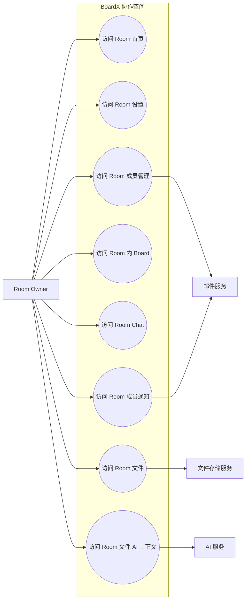

# Room Owner Use Case Diagram

Room Owner 是 Room 的最高权限角色，拥有 Room 设置、成员权限、Room 文件、Room Chat 和 Room 内 Board 的一级模块入口。

```mermaid
flowchart LR
  RoomOwner["Room Owner"]
  Mail["邮件服务"]
  Storage["文件存储服务"]
  AI["AI 服务"]

  subgraph BoardX["BoardX 协作空间"]
    RoomHome(("访问 Room 首页"))
    RoomSettings(("访问 Room 设置"))
    RoomMemberAdmin(("访问 Room 成员管理"))
    RoomBoard(("访问 Room 内 Board"))
    RoomChat(("访问 Room Chat"))
    RoomFiles(("访问 Room 文件"))
    RoomAIContext(("访问 Room 文件 AI 上下文"))
    Notification(("访问 Room 成员通知"))
  end

  RoomOwner --> RoomHome
  RoomOwner --> RoomSettings
  RoomOwner --> RoomMemberAdmin
  RoomOwner --> RoomBoard
  RoomOwner --> RoomChat
  RoomOwner --> RoomFiles
  RoomOwner --> RoomAIContext
  RoomOwner --> Notification

  RoomMemberAdmin --> Mail
  Notification --> Mail
  RoomFiles --> Storage
  RoomAIContext --> AI
```

