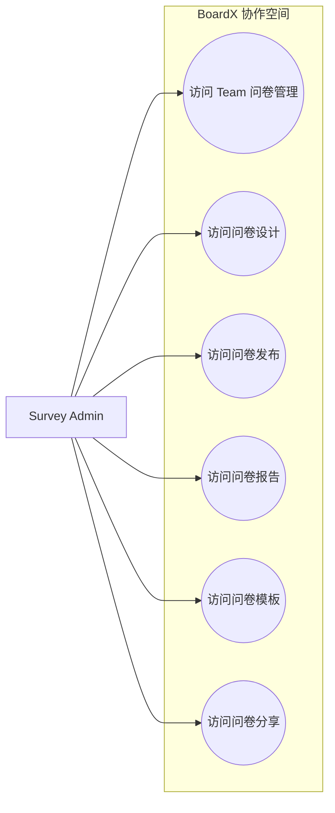

# Survey Admin Use Case Diagram

Survey Admin 对应具备 Team 问卷管理权限的角色，通常是 Team Owner 或 Team Admin。该角色拥有 Team 内问卷管理、发布、报告和模板相关一级模块入口。

```mermaid
flowchart LR
  SurveyAdmin["Survey Admin"]

  subgraph BoardX["BoardX 协作空间"]
    TeamSurvey(("访问 Team 问卷管理"))
    SurveyDesign(("访问问卷设计"))
    SurveyPublish(("访问问卷发布"))
    SurveyReport(("访问问卷报告"))
    SurveyTemplate(("访问问卷模板"))
    SurveyShare(("访问问卷分享"))
  end

  SurveyAdmin --> TeamSurvey
  SurveyAdmin --> SurveyDesign
  SurveyAdmin --> SurveyPublish
  SurveyAdmin --> SurveyReport
  SurveyAdmin --> SurveyTemplate
  SurveyAdmin --> SurveyShare
```

