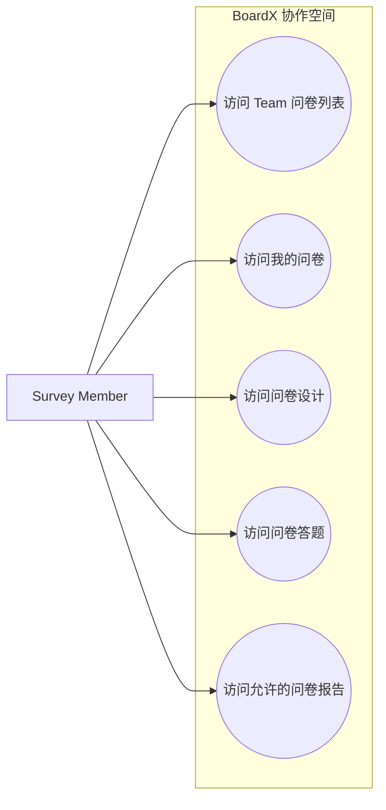

# Survey Member Use Case Diagram

Survey Member 是 Team 中可访问问卷模块的普通成员，主要拥有查看 Team 问卷、创建自己的问卷、查看自己可管理的问卷和答题入口。

```mermaid
flowchart LR
  SurveyMember["Survey Member"]

  subgraph BoardX["BoardX 协作空间"]
    TeamSurvey(("访问 Team 问卷列表"))
    MySurvey(("访问我的问卷"))
    SurveyDesign(("访问问卷设计"))
    SurveyAnswer(("访问问卷答题"))
    SurveyReport(("访问允许的问卷报告"))
  end

  SurveyMember --> TeamSurvey
  SurveyMember --> MySurvey
  SurveyMember --> SurveyDesign
  SurveyMember --> SurveyAnswer
  SurveyMember --> SurveyReport
```

