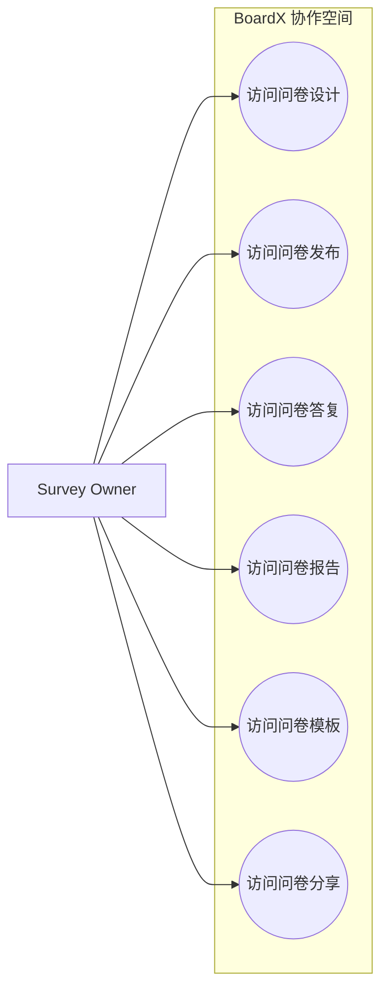

# Survey Owner Use Case Diagram

Survey Owner 是问卷创建者，拥有问卷设计、发布、答复、报告和模板相关一级模块入口。

```mermaid
flowchart LR
  SurveyOwner["Survey Owner"]

  subgraph BoardX["BoardX 协作空间"]
    SurveyDesign(("访问问卷设计"))
    SurveyPublish(("访问问卷发布"))
    SurveyAnswer(("访问问卷答复"))
    SurveyReport(("访问问卷报告"))
    SurveyTemplate(("访问问卷模板"))
    SurveyShare(("访问问卷分享"))
  end

  SurveyOwner --> SurveyDesign
  SurveyOwner --> SurveyPublish
  SurveyOwner --> SurveyAnswer
  SurveyOwner --> SurveyReport
  SurveyOwner --> SurveyTemplate
  SurveyOwner --> SurveyShare
```

