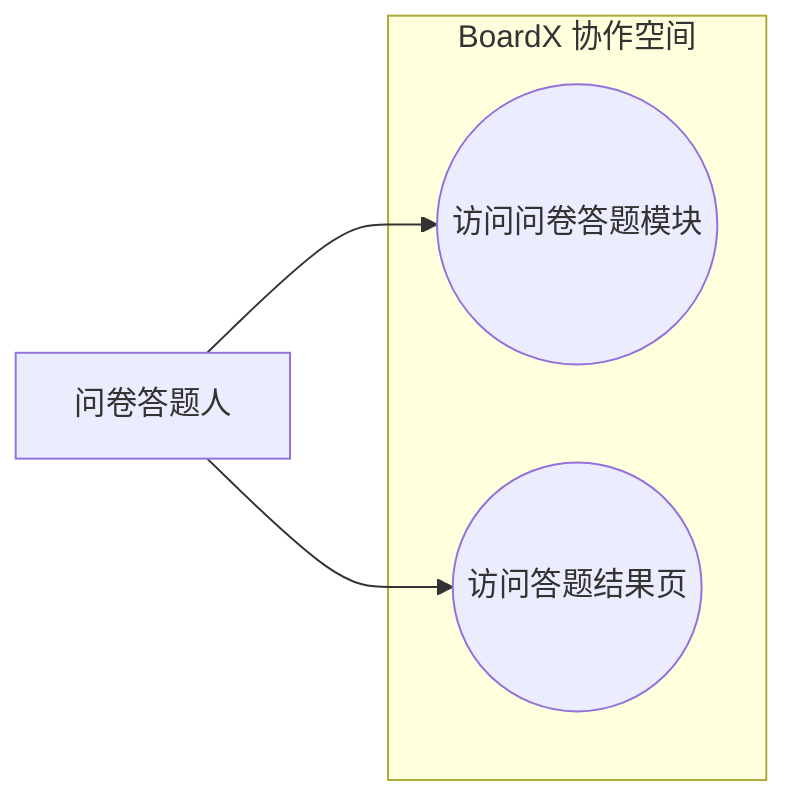

# 问卷答题人 Use Case Diagram

问卷答题人通过公开或受控入口访问问卷答题模块。该角色可以是访客，也可以是已登录用户。

```mermaid
flowchart LR
  SurveyRespondent["问卷答题人"]

  subgraph BoardX["BoardX 协作空间"]
    SurveyAnswer(("访问问卷答题模块"))
    SubmissionResult(("访问答题结果页"))
  end

  SurveyRespondent --> SurveyAnswer
  SurveyRespondent --> SubmissionResult
```
