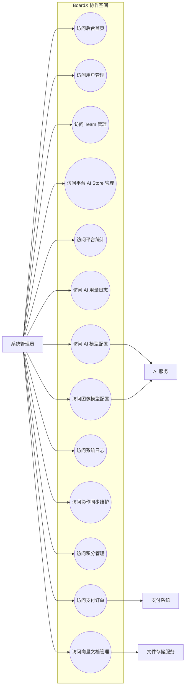

# 系统管理员 Use Case Diagram

系统管理员负责平台级后台一级模块，包括用户、Team、AI Store、统计、模型、日志、积分、支付和同步维护。

```mermaid
flowchart LR
  SysAdmin["系统管理员"]
  AI["AI 服务"]
  Storage["文件存储服务"]
  Payment["支付系统"]

  subgraph BoardX["BoardX 协作空间"]
    AdminHome(("访问后台首页"))
    UserAdmin(("访问用户管理"))
    TeamAdmin(("访问 Team 管理"))
    StoreAdmin(("访问平台 AI Store 管理"))
    Statistics(("访问平台统计"))
    UsageLogs(("访问 AI 用量日志"))
    ModelConfig(("访问 AI 模型配置"))
    ImageModelConfig(("访问图像模型配置"))
    SystemLogs(("访问系统日志"))
    SyncMaintenance(("访问协作同步维护"))
    CreditAdmin(("访问积分管理"))
    PaymentOrders(("访问支付订单"))
    VectorAdmin(("访问向量文档管理"))
  end

  SysAdmin --> AdminHome
  SysAdmin --> UserAdmin
  SysAdmin --> TeamAdmin
  SysAdmin --> StoreAdmin
  SysAdmin --> Statistics
  SysAdmin --> UsageLogs
  SysAdmin --> ModelConfig
  SysAdmin --> ImageModelConfig
  SysAdmin --> SystemLogs
  SysAdmin --> SyncMaintenance
  SysAdmin --> CreditAdmin
  SysAdmin --> PaymentOrders
  SysAdmin --> VectorAdmin

  ModelConfig --> AI
  ImageModelConfig --> AI
  VectorAdmin --> Storage
  PaymentOrders --> Payment
```
