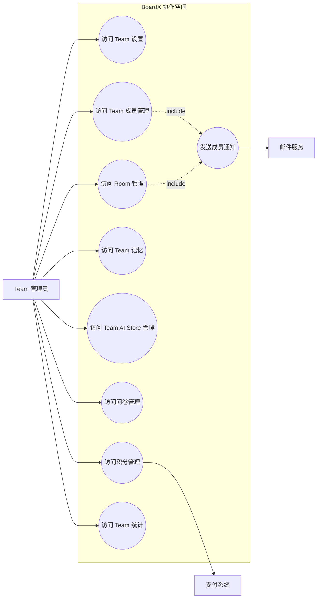

# Team 管理员 Use Case Diagram

Team 管理员负责 Team 管理类一级模块，包括 Team 设置、成员、Room 权限、Team AI Store、问卷模板和积分规则。

```mermaid
flowchart LR
  TeamAdmin["Team 管理员"]
  Mail["邮件服务"]
  Payment["支付系统"]

  subgraph BoardX["BoardX 协作空间"]
    TeamSettings(("访问 Team 设置"))
    MemberAdmin(("访问 Team 成员管理"))
    RoomAdmin(("访问 Room 管理"))
    TeamMemory(("访问 Team 记忆"))
    TeamAIStore(("访问 Team AI Store 管理"))
    SurveyAdmin(("访问问卷管理"))
    CreditAdmin(("访问积分管理"))
    TeamStatistics(("访问 Team 统计"))
    Notification(("发送成员通知"))
  end

  TeamAdmin --> TeamSettings
  TeamAdmin --> MemberAdmin
  TeamAdmin --> RoomAdmin
  TeamAdmin --> TeamMemory
  TeamAdmin --> TeamAIStore
  TeamAdmin --> SurveyAdmin
  TeamAdmin --> CreditAdmin
  TeamAdmin --> TeamStatistics

  MemberAdmin -.->|include| Notification
  RoomAdmin -.->|include| Notification
  Notification --> Mail
  CreditAdmin --> Payment
```
