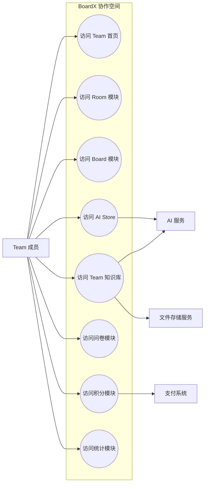

# Team 成员 Use Case Diagram

Team 成员可以进入 Team 工作区，最外层可操作模块包括 Room、Board、AI Store、Team 知识库、问卷、积分和统计。

```mermaid
flowchart LR
  TeamMember["Team 成员"]
  AI["AI 服务"]
  Storage["文件存储服务"]
  Payment["支付系统"]

  subgraph BoardX["BoardX 协作空间"]
    TeamHome(("访问 Team 首页"))
    Room(("访问 Room 模块"))
    Board(("访问 Board 模块"))
    AIStore(("访问 AI Store"))
    Knowledge(("访问 Team 知识库"))
    Survey(("访问问卷模块"))
    Credits(("访问积分模块"))
    Statistics(("访问统计模块"))
  end

  TeamMember --> TeamHome
  TeamMember --> Room
  TeamMember --> Board
  TeamMember --> AIStore
  TeamMember --> Knowledge
  TeamMember --> Survey
  TeamMember --> Credits
  TeamMember --> Statistics

  AIStore --> AI
  Knowledge --> Storage
  Knowledge --> AI
  Credits --> Payment
```
