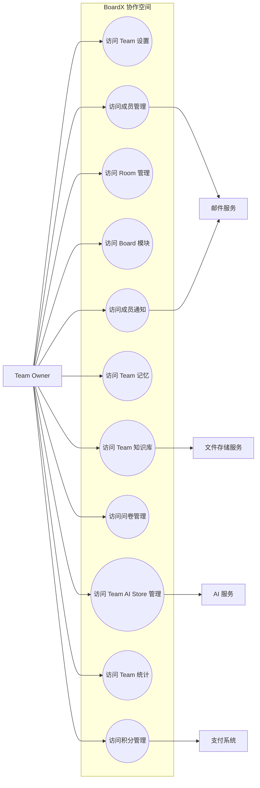

# Team Owner Use Case Diagram

Team Owner 是 Team 的最高权限角色，拥有 Team 管理、成员管理、Room 管理、AI Store 管理、问卷、知识库、积分和统计等一级模块入口。

```mermaid
flowchart LR
  TeamOwner["Team Owner"]
  Mail["邮件服务"]
  Payment["支付系统"]
  Storage["文件存储服务"]
  AI["AI 服务"]

  subgraph BoardX["BoardX 协作空间"]
    TeamSettings(("访问 Team 设置"))
    MemberAdmin(("访问成员管理"))
    RoomAdmin(("访问 Room 管理"))
    Board(("访问 Board 模块"))
    Knowledge(("访问 Team 知识库"))
    TeamMemory(("访问 Team 记忆"))
    TeamAIStore(("访问 Team AI Store 管理"))
    SurveyAdmin(("访问问卷管理"))
    CreditAdmin(("访问积分管理"))
    TeamStatistics(("访问 Team 统计"))
    Notification(("访问成员通知"))
  end

  TeamOwner --> TeamSettings
  TeamOwner --> MemberAdmin
  TeamOwner --> RoomAdmin
  TeamOwner --> Board
  TeamOwner --> Knowledge
  TeamOwner --> TeamMemory
  TeamOwner --> TeamAIStore
  TeamOwner --> SurveyAdmin
  TeamOwner --> CreditAdmin
  TeamOwner --> TeamStatistics
  TeamOwner --> Notification

  MemberAdmin --> Mail
  Notification --> Mail
  CreditAdmin --> Payment
  Knowledge --> Storage
  TeamAIStore --> AI
```

