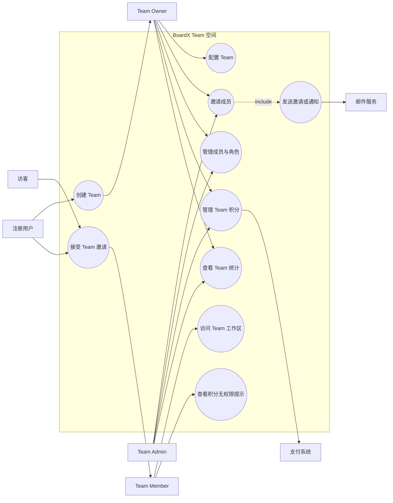
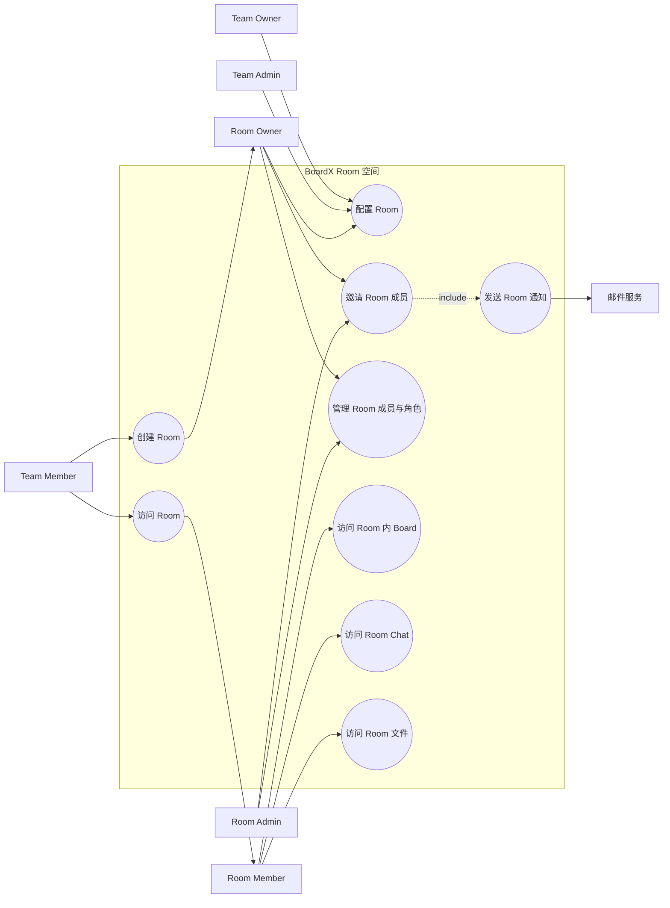
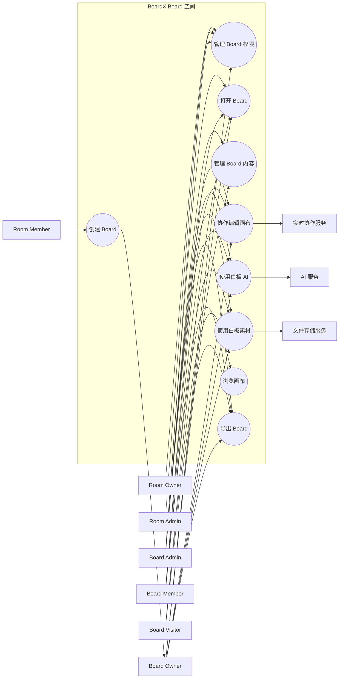
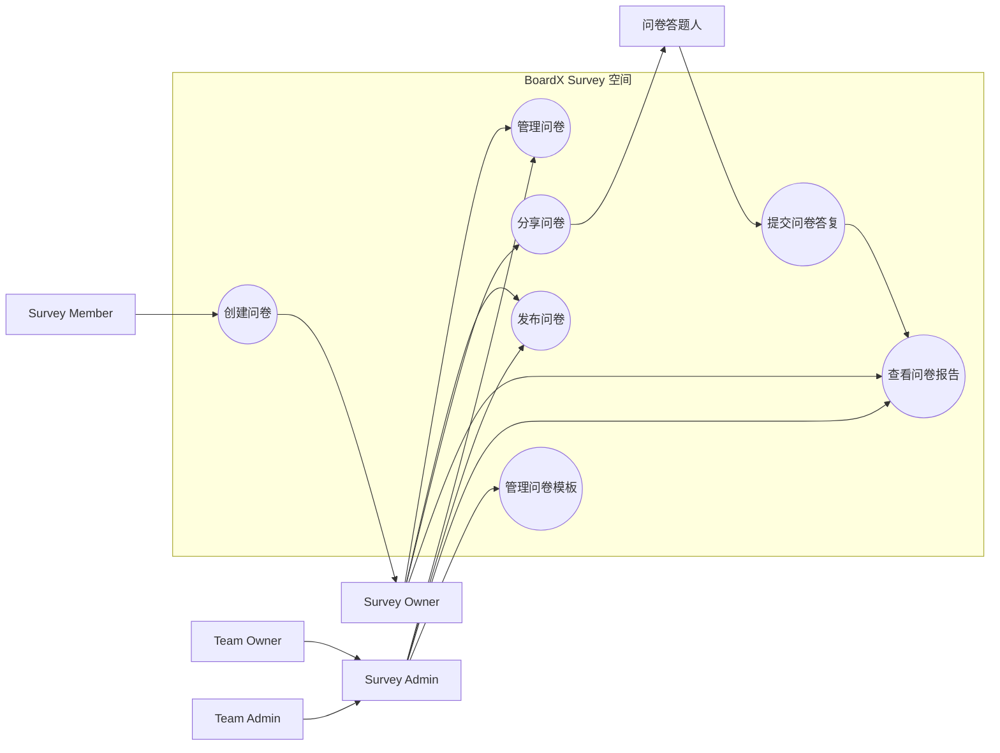
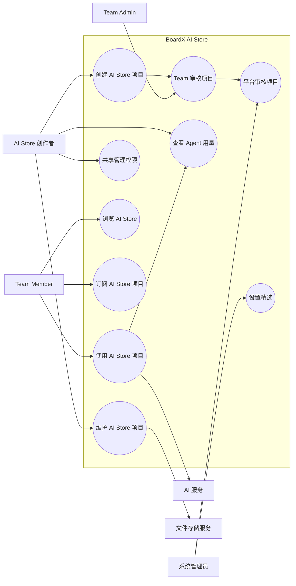

# BoardX 多角色交互 Use Case Diagram

本文档补充“不同角色之间如何交互”的 Use Case Diagram。单角色图用于说明某个角色能访问哪些一级模块；本文件用于说明多个角色围绕同一个业务目标如何协作、授权、审核、提交和管理。

## Team 角色交互

## Room 角色交互

## Board 角色交互

## Survey 角色交互

## AI Store 角色交互

