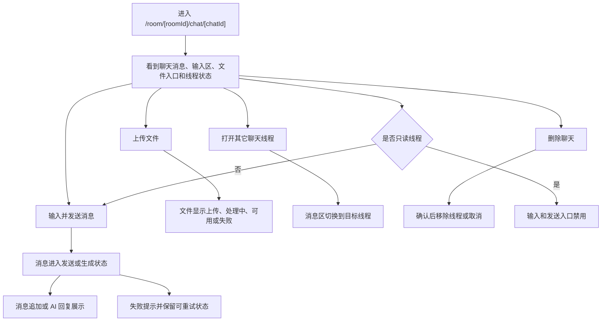

# Room Chat 交互图

```mermaid
flowchart TD
  ChatPage["进入 /room/[roomId]/chat/[chatId]"] --> MessageList["看到聊天消息、输入区、文件入口和线程状态"]
  MessageList --> Send["输入并发送消息"]
  Send --> Sending["消息进入发送或生成状态"]
  Sending --> Reply["消息追加或 AI 回复展示"]
  Sending --> SendFail["失败提示并保留可重试状态"]
  MessageList --> Upload["上传文件"]
  Upload --> FileState["文件显示上传、处理中、可用或失败"]
  MessageList --> Switch["打开其它聊天线程"]
  Switch --> OtherThread["消息区切换到目标线程"]
  MessageList --> Delete["删除聊天"]
  Delete --> DeleteConfirm["确认后移除线程或取消"]
  MessageList --> Readonly{"是否只读线程"}
  Readonly -->|是| DisableInput["输入和发送入口禁用"]
  Readonly -->|否| Send
```

