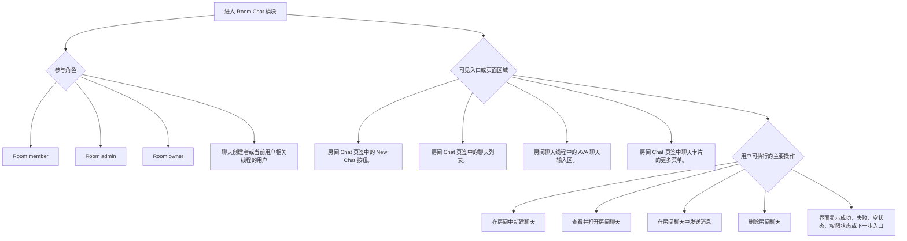

# Room Chat 粗粒度交互图

本图用于快速说明 Room Chat 模块有哪些参与角色、入口、主要能力和结果状态。它不展开每个控件的全部状态，详细交互见 [room-chat-detailed-interaction-diagram.md](./room-chat-detailed-interaction-diagram.md)。

```mermaid
flowchart TD
  Start["进入 Room Chat 模块"]
  Start --> Actors{"参与角色"}
  Actors --> A1["Room member"]
  Actors --> A2["Room admin"]
  Actors --> A3["Room owner"]
  Actors --> A4["聊天创建者或当前用户相关线程的用户"]
  Start --> Entry{"可见入口或页面区域"}
  Entry --> E1["房间 Chat 页签中的 New Chat 按钮。"]
  Entry --> E2["房间 Chat 页签中的聊天列表。"]
  Entry --> E3["房间聊天线程中的 AVA 聊天输入区。"]
  Entry --> E4["房间 Chat 页签中聊天卡片的更多菜单。"]
  Entry --> Capabilities{"用户可执行的主要操作"}
  Capabilities --> UC1["在房间中新建聊天"]
  Capabilities --> UC2["查看并打开房间聊天"]
  Capabilities --> UC3["在房间聊天中发送消息"]
  Capabilities --> UC4["删除房间聊天"]
  Capabilities --> Result["界面显示成功、失败、空状态、权限状态或下一步入口"]
```
