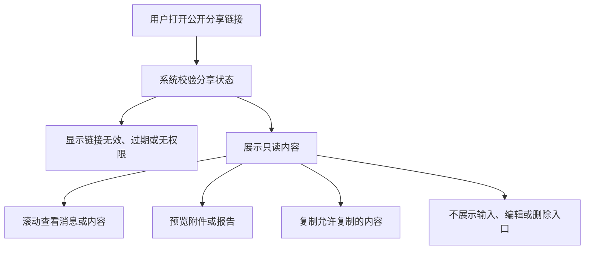

# Share 交互图

```mermaid
flowchart TD
  Link["用户打开公开分享链接"] --> Validate["系统校验分享状态"]
  Validate --> Invalid["显示链接无效、过期或无权限"]
  Validate --> Readonly["展示只读内容"]
  Readonly --> Scroll["滚动查看消息或内容"]
  Readonly --> Preview["预览附件或报告"]
  Readonly --> Copy["复制允许复制的内容"]
  Readonly --> NoEdit["不展示输入、编辑或删除入口"]
```

