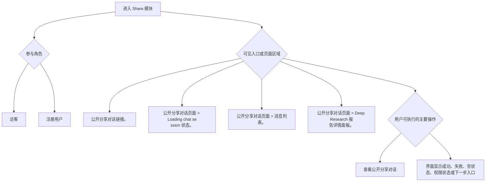

# Share 粗粒度交互图

本图用于快速说明 Share 模块有哪些参与角色、入口、主要能力和结果状态。它不展开每个控件的全部状态，详细交互见 [share-detailed-interaction-diagram.md](./share-detailed-interaction-diagram.md)。

```mermaid
flowchart TD
  Start["进入 Share 模块"]
  Start --> Actors{"参与角色"}
  Actors --> A1["访客"]
  Actors --> A2["注册用户"]
  Start --> Entry{"可见入口或页面区域"}
  Entry --> E1["公开分享对话链接。"]
  Entry --> E2["公开分享对话页面 > Loading chat se<br/>ssion 状态。"]
  Entry --> E3["公开分享对话页面 > 消息列表。"]
  Entry --> E4["公开分享对话页面 > Deep Research 报<br/>告详情面板。"]
  Entry --> Capabilities{"用户可执行的主要操作"}
  Capabilities --> UC1["查看公开分享对话"]
  Capabilities --> Result["界面显示成功、失败、空状态、权限状态或下一步入口"]
```
