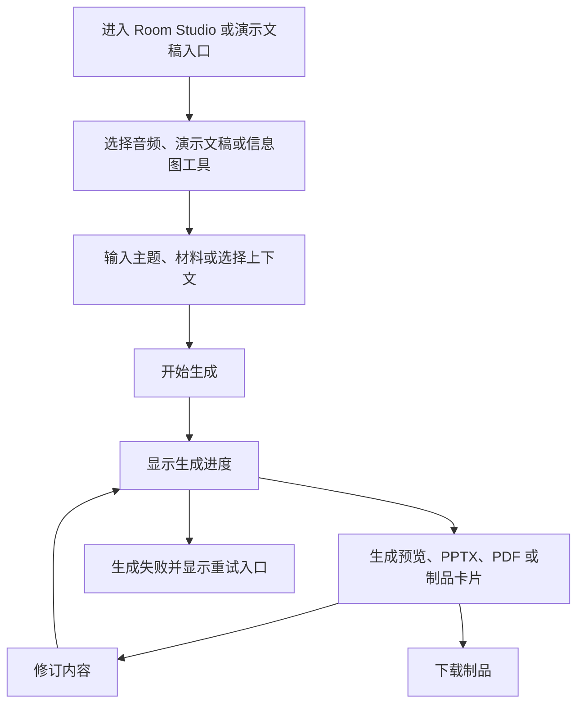

# Studio / Presentations 交互图

```mermaid
flowchart TD
  Studio["进入 Room Studio 或演示文稿入口"] --> ChooseTool["选择音频、演示文稿或信息图工具"]
  ChooseTool --> Input["输入主题、材料或选择上下文"]
  Input --> Generate["开始生成"]
  Generate --> Progress["显示生成进度"]
  Progress --> Artifact["生成预览、PPTX、PDF 或制品卡片"]
  Progress --> Failed["生成失败并显示重试入口"]
  Artifact --> Revise["修订内容"]
  Revise --> Progress
  Artifact --> Download["下载制品"]
```

