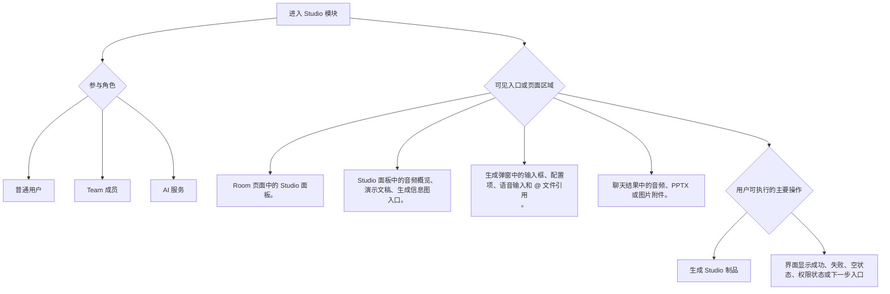

# Studio 粗粒度交互图

本图用于快速说明 Studio 模块有哪些参与角色、入口、主要能力和结果状态。它不展开每个控件的全部状态，详细交互见 [studio-detailed-interaction-diagram.md](./studio-detailed-interaction-diagram.md)。

```mermaid
flowchart TD
  Start["进入 Studio 模块"]
  Start --> Actors{"参与角色"}
  Actors --> A1["普通用户"]
  Actors --> A2["Team 成员"]
  Actors --> A3["AI 服务"]
  Start --> Entry{"可见入口或页面区域"}
  Entry --> E1["Room 页面中的 Studio 面板。"]
  Entry --> E2["Studio 面板中的音频概览、演示文稿、生成信息图<br/>入口。"]
  Entry --> E3["生成弹窗中的输入框、配置项、语音输入和 @ 文件引用<br/>。"]
  Entry --> E4["聊天结果中的音频、PPTX 或图片附件。"]
  Entry --> Capabilities{"用户可执行的主要操作"}
  Capabilities --> UC1["生成 Studio 制品"]
  Capabilities --> Result["界面显示成功、失败、空状态、权限状态或下一步入口"]
```
