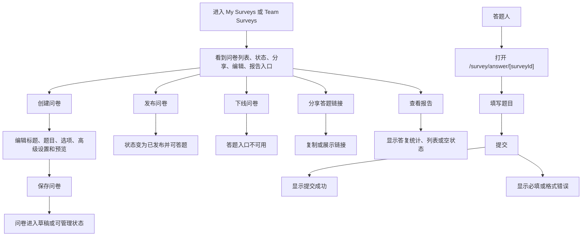

# Survey 交互图

```mermaid
flowchart TD
  SurveyHome["进入 My Surveys 或 Team Surveys"] --> List["看到问卷列表、状态、分享、编辑、报告入口"]
  List --> Create["创建问卷"]
  Create --> Editor["编辑标题、题目、选项、高级设置和预览"]
  Editor --> Save["保存问卷"]
  Save --> Draft["问卷进入草稿或可管理状态"]
  List --> Publish["发布问卷"]
  Publish --> Published["状态变为已发布并可答题"]
  List --> Unpublish["下线问卷"]
  Unpublish --> Offline["答题入口不可用"]
  List --> Share["分享答题链接"]
  Share --> Link["复制或展示链接"]
  Respondent["答题人"] --> AnswerPage["打开 /survey/answer/[surveyId]"]
  AnswerPage --> Fill["填写题目"]
  Fill --> Submit["提交"]
  Submit --> SubmitOk["显示提交成功"]
  Submit --> SubmitFail["显示必填或格式错误"]
  List --> Report["查看报告"]
  Report --> ReportView["显示答复统计、列表或空状态"]
```

