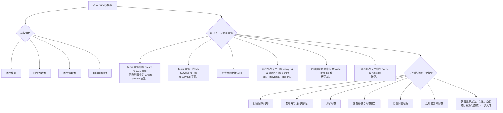

# Survey 粗粒度交互图

本图用于快速说明 Survey 模块有哪些参与角色、入口、主要能力和结果状态。它不展开每个控件的全部状态，详细交互见 [survey-detailed-interaction-diagram.md](./survey-detailed-interaction-diagram.md)。

```mermaid
flowchart TD
  Start["进入 Survey 模块"]
  Start --> Actors{"参与角色"}
  Actors --> A1["团队成员"]
  Actors --> A2["问卷创建者"]
  Actors --> A3["团队管理者"]
  Actors --> A4["Respondent"]
  Start --> Entry{"可见入口或页面区域"}
  Entry --> E1["Team 区域中的 Create Survey 页面<br/>；问卷列表中的 Create Survey 按钮。"]
  Entry --> E2["Team 区域中的 My Surveys 和 Tea<br/>m Surveys 页面。"]
  Entry --> E3["问卷答题链接页面。"]
  Entry --> E4["问卷列表卡片中的 View，以及结果区中的 Summ<br/>ary、Individual、Report。"]
  Entry --> E5["创建问卷页面中的 Choose template 模<br/>板区域。"]
  Entry --> E6["问卷列表卡片中的 Pause 或 Activate <br/>按钮。"]
  Entry --> Capabilities{"用户可执行的主要操作"}
  Capabilities --> UC1["创建团队问卷"]
  Capabilities --> UC2["查看并管理问卷列表"]
  Capabilities --> UC3["填写问卷"]
  Capabilities --> UC4["查看答卷与问卷报告"]
  Capabilities --> UC5["管理问卷模板"]
  Capabilities --> UC6["启用或暂停问卷"]
  Capabilities --> Result["界面显示成功、失败、空状态、权限状态或下一步入口"]
```
