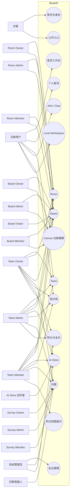

# BoardX 顶层角色功能 Use Case Diagram

本文档先从最顶层描述不同角色能操作的一级功能模块。模块内部用例在各模块目录或角色交互图中继续展开。

```mermaid
flowchart LR
  Guest["访客"]
  User["注册用户"]
  TeamOwner["Team Owner"]
  TeamAdmin["Team Admin"]
  TeamMember["Team Member"]
  RoomOwner["Room Owner"]
  RoomAdmin["Room Admin"]
  RoomMember["Room Member"]
  BoardOwner["Board Owner"]
  BoardAdmin["Board Admin"]
  BoardMember["Board Member"]
  BoardVisitor["Board Visitor"]
  SurveyOwner["Survey Owner"]
  SurveyAdmin["Survey Admin"]
  SurveyMember["Survey Member"]
  Respondent["问卷答题人"]
  StoreCreator["AI Store 创作者"]
  SysAdmin["系统管理员"]

  subgraph BoardX["BoardX"]
    Auth(("账号与身份"))
    PublicEntry(("公开入口"))
    Home(("首页工作台"))
    Profile(("个人账号"))
    Team(("Team"))
    Room(("Room"))
    Board(("Board"))
    Canvas(("Canvas 白板编辑"))
    Ava(("AVA / Chat"))
    AIStore(("AI Store"))
    Knowledge(("知识库"))
    Survey(("问卷"))
    Credits(("积分与支付"))
    CreditsNotice(("积分权限提示"))
    Admin(("后台管理"))
    LocalWorkspace(("Local Workspace"))
  end

  Guest --> Auth
  Guest --> PublicEntry
  User --> Home
  User --> Profile
  User --> Team
  User --> Ava
  User --> Knowledge
  User --> LocalWorkspace

  TeamOwner --> Team
  TeamOwner --> Room
  TeamOwner --> Board
  TeamOwner --> AIStore
  TeamOwner --> Knowledge
  TeamOwner --> Survey
  TeamOwner --> Credits
  TeamAdmin --> Team
  TeamAdmin --> Room
  TeamAdmin --> Board
  TeamAdmin --> AIStore
  TeamAdmin --> Knowledge
  TeamAdmin --> Survey
  TeamAdmin --> Credits
  TeamMember --> Team
  TeamMember --> Room
  TeamMember --> Board
  TeamMember --> AIStore
  TeamMember --> Knowledge
  TeamMember --> Survey
  TeamMember --> CreditsNotice

  RoomOwner --> Room
  RoomOwner --> Board
  RoomAdmin --> Room
  RoomAdmin --> Board
  RoomMember --> Room
  RoomMember --> Board

  BoardOwner --> Board
  BoardOwner --> Canvas
  BoardAdmin --> Board
  BoardAdmin --> Canvas
  BoardMember --> Board
  BoardMember --> Canvas
  BoardVisitor --> Board

  SurveyOwner --> Survey
  SurveyAdmin --> Survey
  SurveyMember --> Survey
  Respondent --> Survey

  StoreCreator --> AIStore
  SysAdmin --> Admin
  SysAdmin --> AIStore
  SysAdmin --> Credits
```
